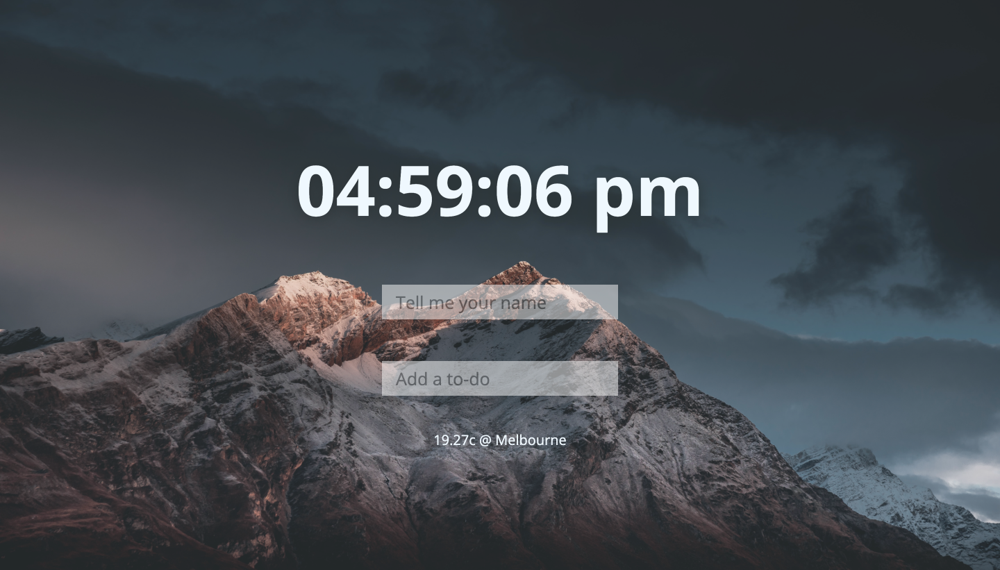
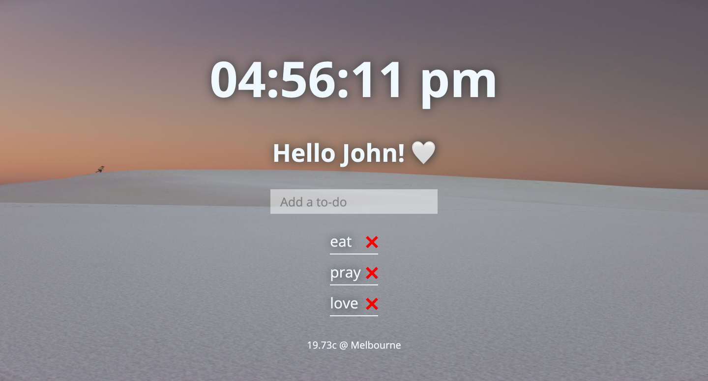

# Vanilla_JS-app

Making an app and practicing Vanilla JS
Coloning Momentum

[github-pages](https://minapark127.github.io/Vanilla-JS-First-App/)

### Sample pages

|                        **Home**                        |
| :----------------------------------------------------: |
|  |
|                     **Add todos**                      |
|       |
